Regression Dianostics with R
================

## 1. Analyzing a housing dataset (Ames Housing Dataset)

Introduction:

What are the variables that influence the pricing (Sale Price) of houses in Ames, Iowa? This paper aims to answer this question by creating a regression model that can predict the monetary cost of housing. To achieve this goal, a dataset of the real estate market in Iowa from 2006 to 2016 will be used.
  
### 2. EDA

``` r
#a. Visualizing summary of the data set
#summary(ames.housing)
#b. creating data subset without character variables
data.only.numeric<-ames.housing[, !sapply(ames.housing, is.character)]
#c. Looking for NA values
#summary(data.only.numeric)
dim(data.only.numeric)
```

    ## [1] 2930   39

``` r
only.numeric.noNA<- na.omit(data.only.numeric)
```

### 3. Creating a Correlation Matrix

``` r
correlation.matrix<- cor(only.numeric.noNA, method ="pearson")
corrplot::corrplot(cor(correlation.matrix), tl.cex = 0.4)
```

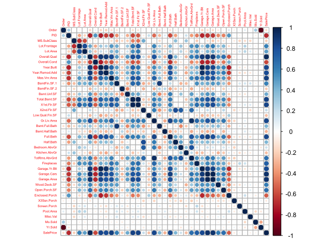<!-- -->

    Interpretation:

The predictor's that influence the pricing of houses the most: Overall.Qual(0.8), Gr.Liv.Area(0.71), Garage.Cars(0.66), Total.Bsmt.SF(0.65), Garage area(0.65), Full Bath(0.56), Year.Built(0.56), garage.Yr.Blt(0.54), Year.Remod.Add(0.54), Mas.Vnr.Area (0.52), and TotRms.AbvGrd(0.52). 

### 4. Creating Graphs

``` r
library("car")
scatterplot(Yr.Sold~SalePrice, data = ames.housing)
```

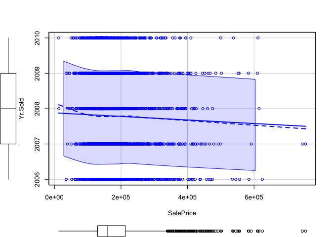<!-- -->

``` r
scatterplot(Lot.Area~SalePrice, data=ames.housing)
```

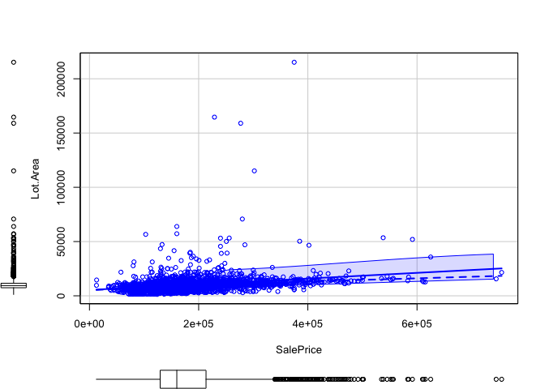<!-- -->
### 5. Plotting Scatterplots with variable with highest and lowest
correlation with SalePrice

``` r
library(ggplot2)
#a. Variable with highest correlation with SalePrice
only.numeric.noNA$Overall.Qual<- as.numeric(only.numeric.noNA$Overall.Qual)
only.numeric.noNA$SalePrice<- as.numeric(only.numeric.noNA$SalePrice)
ggplot(data =only.numeric.noNA) + aes(x = Overall.Qual, y = SalePrice, log="y") + theme_light()+ 
  geom_jitter(col="salmon")+ geom_smooth(method='lm', formula= y~x) + ylab("Sale Price") + xlab("Overall Quality") + ggtitle("Linear Regression Overall Quality and Sale Price") 
```

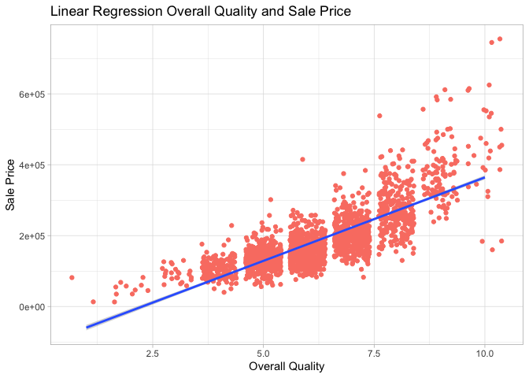<!-- -->
### 6. Variable with lowest correlation with SalePrice

``` r
ggplot(data =only.numeric.noNA) + aes(x = Misc.Val, y = SalePrice, log="y") + theme_light()+ 
  geom_jitter(col="lightblue")+ geom_smooth(method='lm', formula= y~x) + ylab("Sale Price") + xlab("Miscellaneous feature not covered in other categories") + ggtitle("Linear Regression Miscellaneous feature and Sale Price") 
```

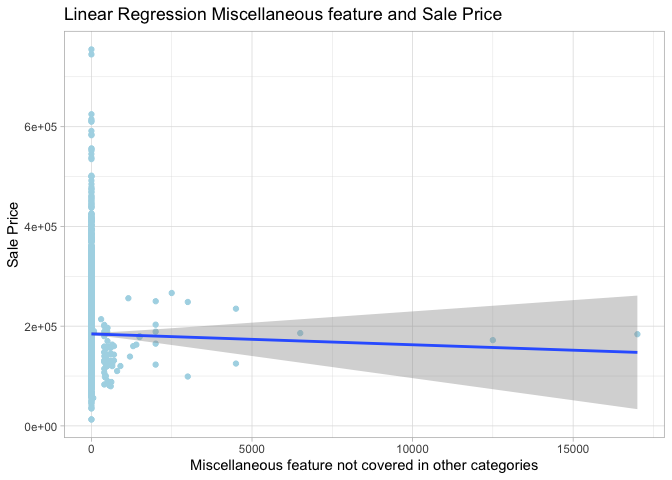<!-- -->
### 7. Variable with a correlation closest to 0.5

``` r
ggplot(data =only.numeric.noNA) + aes(x = TotRms.AbvGrd, y = SalePrice, log="y") + theme_light()+ 
  geom_jitter(col="gray")+ geom_smooth(method='lm', formula= y~x) + ylab("Sale Price") + xlab("Total rooms above grade") + ggtitle("Linear Regression Total rooms above grade and Sale Price") 
```

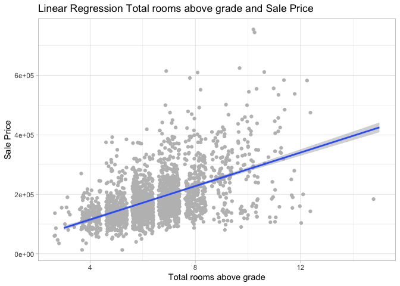<!-- -->

    Interpretation:

    The higher the correlation coefficient between the predictor and the price of housing, the better the linear regression fits. I.E, in Figure 4 the correlation is very close to 0, thus, the data points are scattered and clustered and don’t appear to follow a linear trajectory.

Furthermore, in Figure 5 the linear relationship is also not sufficiently good since the points become scattered towards the end.

    On the contrary, the graphs from Figure 3 and Figure 5 showcase a distinguishable linear relationship between their independent variables and the dependent variables. Thus, these predictors are good candidates to be used in our regression model.

 Finally, a regression model was created using the continuous variables with the highest correlation coefficients with SalePrice. Thus, the mathematical equation of the model was created by using the predictors Garage.Area, Gr.Liv.Area, and Total.Bsmt.SF, and the dependent variable SalePrice.

### 8. Creating regression model with 3 continuous variables

``` r
#a. Creating regression model
library(sjPlot)
attach(only.numeric.noNA)
Table_regression <- lm(SalePrice ~ Garage.Area + Gr.Liv.Area + Total.Bsmt.SF)
tab_model(Table_regression)
```

<table style="border-collapse:collapse; border:none;">
<tr>
<th style="border-top: double; text-align:center; font-style:normal; font-weight:bold; padding:0.2cm;  text-align:left; ">
 
</th>
<th colspan="3" style="border-top: double; text-align:center; font-style:normal; font-weight:bold; padding:0.2cm; ">
SalePrice
</th>
</tr>
<tr>
<td style=" text-align:center; border-bottom:1px solid; font-style:italic; font-weight:normal;  text-align:left; ">
Predictors
</td>
<td style=" text-align:center; border-bottom:1px solid; font-style:italic; font-weight:normal;  ">
Estimates
</td>
<td style=" text-align:center; border-bottom:1px solid; font-style:italic; font-weight:normal;  ">
CI
</td>
<td style=" text-align:center; border-bottom:1px solid; font-style:italic; font-weight:normal;  ">
p
</td>
</tr>
<tr>
<td style=" padding:0.2cm; text-align:left; vertical-align:top; text-align:left; ">
(Intercept)
</td>
<td style=" padding:0.2cm; text-align:left; vertical-align:top; text-align:center;  ">
-40818.97
</td>
<td style=" padding:0.2cm; text-align:left; vertical-align:top; text-align:center;  ">
-47543.94 – -34094.00
</td>
<td style=" padding:0.2cm; text-align:left; vertical-align:top; text-align:center;  ">
<strong>\<0.001</strong>
</td>
</tr>
<tr>
<td style=" padding:0.2cm; text-align:left; vertical-align:top; text-align:left; ">
Garage Area
</td>
<td style=" padding:0.2cm; text-align:left; vertical-align:top; text-align:center;  ">
113.69
</td>
<td style=" padding:0.2cm; text-align:left; vertical-align:top; text-align:center;  ">
101.03 – 126.35
</td>
<td style=" padding:0.2cm; text-align:left; vertical-align:top; text-align:center;  ">
<strong>\<0.001</strong>
</td>
</tr>
<tr>
<td style=" padding:0.2cm; text-align:left; vertical-align:top; text-align:left; ">
Gr Liv Area
</td>
<td style=" padding:0.2cm; text-align:left; vertical-align:top; text-align:center;  ">
72.24
</td>
<td style=" padding:0.2cm; text-align:left; vertical-align:top; text-align:center;  ">
67.51 – 76.96
</td>
<td style=" padding:0.2cm; text-align:left; vertical-align:top; text-align:center;  ">
<strong>\<0.001</strong>
</td>
</tr>
<tr>
<td style=" padding:0.2cm; text-align:left; vertical-align:top; text-align:left; ">
Total Bsmt SF
</td>
<td style=" padding:0.2cm; text-align:left; vertical-align:top; text-align:center;  ">
56.20
</td>
<td style=" padding:0.2cm; text-align:left; vertical-align:top; text-align:center;  ">
50.88 – 61.52
</td>
<td style=" padding:0.2cm; text-align:left; vertical-align:top; text-align:center;  ">
<strong>\<0.001</strong>
</td>
</tr>
<tr>
<td style=" padding:0.2cm; text-align:left; vertical-align:top; text-align:left; padding-top:0.1cm; padding-bottom:0.1cm; border-top:1px solid;">
Observations
</td>
<td style=" padding:0.2cm; text-align:left; vertical-align:top; padding-top:0.1cm; padding-bottom:0.1cm; text-align:left; border-top:1px solid;" colspan="3">
2274
</td>
</tr>
<tr>
<td style=" padding:0.2cm; text-align:left; vertical-align:top; text-align:left; padding-top:0.1cm; padding-bottom:0.1cm;">
R<sup>2</sup> / R<sup>2</sup> adjusted
</td>
<td style=" padding:0.2cm; text-align:left; vertical-align:top; padding-top:0.1cm; padding-bottom:0.1cm; text-align:left;" colspan="3">
0.677 / 0.677
</td>
</tr>
</table>

``` r
summary(Table_regression)
```

    ## 
    ## Call:
    ## lm(formula = SalePrice ~ Garage.Area + Gr.Liv.Area + Total.Bsmt.SF)
    ## 
    ## Residuals:
    ##     Min      1Q  Median      3Q     Max 
    ## -711329  -19612     689   19623  257538 
    ## 
    ## Coefficients:
    ##                 Estimate Std. Error t value Pr(>|t|)    
    ## (Intercept)   -40818.970   3429.340  -11.90   <2e-16 ***
    ## Garage.Area      113.694      6.456   17.61   <2e-16 ***
    ## Gr.Liv.Area       72.236      2.408   30.00   <2e-16 ***
    ## Total.Bsmt.SF     56.199      2.713   20.72   <2e-16 ***
    ## ---
    ## Signif. codes:  0 '***' 0.001 '**' 0.01 '*' 0.05 '.' 0.1 ' ' 1
    ## 
    ## Residual standard error: 47400 on 2270 degrees of freedom
    ## Multiple R-squared:  0.6769, Adjusted R-squared:  0.6765 
    ## F-statistic:  1585 on 3 and 2270 DF,  p-value: < 2.2e-16

    Interpretation:

    As can be seen from the model, all 3 variables’ coefficients (Garage.Area, Gr.Liv.Area, and Total.Bsmt.SF) have a p-value lower than 0.05 which means that they are all significant and should remain in the model. Moreover, the adjusted R2 of the model is quite high, which is a good sign.

``` r
#b. Plotting regression model
plot(Table_regression)
```

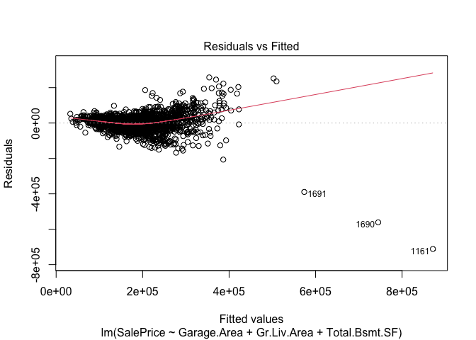<!-- -->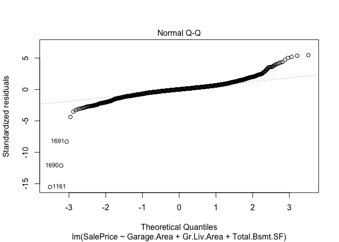<!-- -->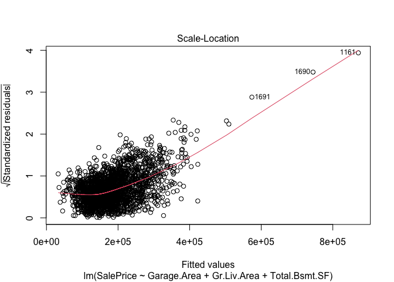<!-- -->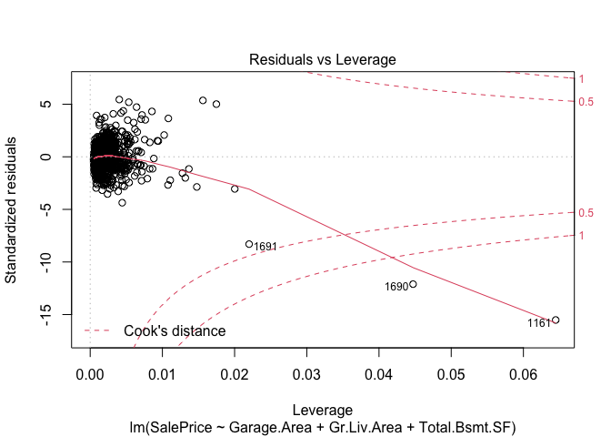<!-- -->

``` r
par(mfrow = c (2,2))

#6. Checking the model for multicollinearity
vif(Table_regression)
```

    ##   Garage.Area   Gr.Liv.Area Total.Bsmt.SF 
    ##      1.584434      1.476988      1.492049

    Interpretation:

The Homoscedasticity assumption was violated by our model since in the Scale-Location graph the points aren't scattered. Moreover, in the Normal Q-Q Plot, the points don’t align perfectly with the line. Nonetheless, it is also important to mention that the disparity isn’t extreme either. 

Finally,  there are a few outliers or possible unusual observations in the residuals vs fitted plot, and the residuals vs leverage plot. (These data points should be removed moving forward to fix the model).

### 9. Looking for unusual observations or outliers

``` r
outlierTest(model=Table_regression)
```

    ##        rstudent unadjusted p-value Bonferroni p
    ## 1161 -16.406359         2.9881e-57   6.7949e-54
    ## 1690 -12.515509         8.4211e-35   1.9150e-31
    ## 1691  -8.426969         6.2079e-17   1.4117e-13
    ## 39     5.478963         4.7515e-08   1.0805e-04
    ## 1365   5.393770         7.6155e-08   1.7318e-04
    ## 831    5.217333         1.9799e-07   4.5023e-04
    ## 1360   5.037173         5.0971e-07   1.1591e-03
    ## 337    4.746893         2.1943e-06   4.9899e-03
    ## 338    4.383753         1.2197e-05   2.7737e-02
    ## 2000  -4.383613         1.2205e-05   2.7754e-02

``` r
hat.plot <- function (fit) {
  p <- length(coefficients(Table_regression))
  n <- length (fitted(Table_regression))
  plot(hatvalues(Table_regression), main = "Index Plot of hat Values")
  abline(h=c(2,3)*p/n, col= "red", lty=2)
  identify(1:n, hatvalues(Table_regression), names(hatvalues(Table_regression)))
}
```

``` r
#b. Looking at Cook's D Chart
library(olsrr)
```

    ## 
    ## Attaching package: 'olsrr'

    ## The following object is masked from 'package:datasets':
    ## 
    ##     rivers

``` r
ols_plot_cooksd_chart(Table_regression)
```

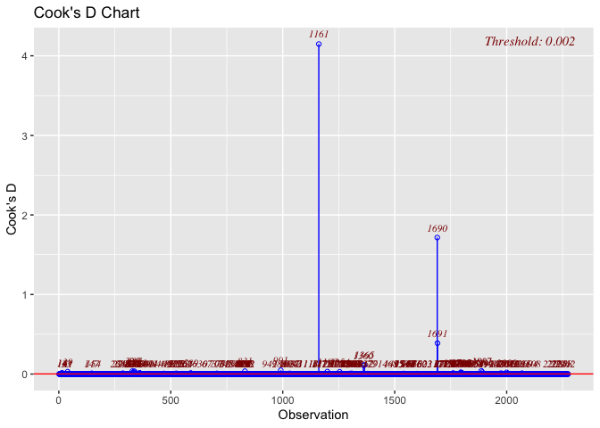<!-- -->

``` r
hat.plot(Table_regression)
```

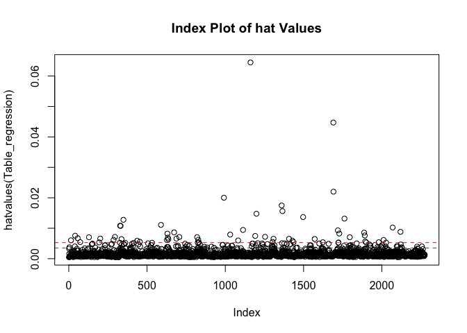<!-- -->

    ## integer(0)

    Interpretation:

    As can be observed, once again our model contains a few outliers.
     Also, in the graph below this observation becomes apparent once again, thus, these outliers should be removed because they go beyond the red line).

### 10. Eliminating unusual observations to improve model

``` r
cooksd <- cooks.distance(Table_regression)
sample_size <- nrow(data.only.numeric)
influential <- as.numeric(names(cooksd)[(cooksd > (4/sample_size))])
only.numeric.no.outliers <- only.numeric.noNA[-influential, ]


#a. Looking at model now
attach(only.numeric.no.outliers)
```

    ## The following objects are masked from only.numeric.noNA:
    ## 
    ##     Bedroom.AbvGr, Bsmt.Full.Bath, Bsmt.Half.Bath, Bsmt.Unf.SF,
    ##     BsmtFin.SF.1, BsmtFin.SF.2, Enclosed.Porch, Fireplaces, Full.Bath,
    ##     Garage.Area, Garage.Cars, Garage.Yr.Blt, Gr.Liv.Area, Half.Bath,
    ##     Kitchen.AbvGr, Lot.Area, Lot.Frontage, Low.Qual.Fin.SF,
    ##     Mas.Vnr.Area, Misc.Val, Mo.Sold, MS.SubClass, Open.Porch.SF, Order,
    ##     Overall.Cond, Overall.Qual, PID, Pool.Area, SalePrice,
    ##     Screen.Porch, Total.Bsmt.SF, TotRms.AbvGrd, Wood.Deck.SF,
    ##     X1st.Flr.SF, X2nd.Flr.SF, X3Ssn.Porch, Year.Built, Year.Remod.Add,
    ##     Yr.Sold

``` r
Table_regression2 <- lm(SalePrice ~ Garage.Area + Gr.Liv.Area + Total.Bsmt.SF)
plot(Table_regression2)
```

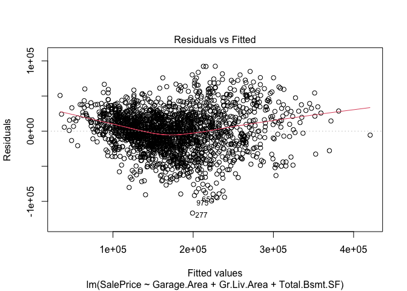<!-- -->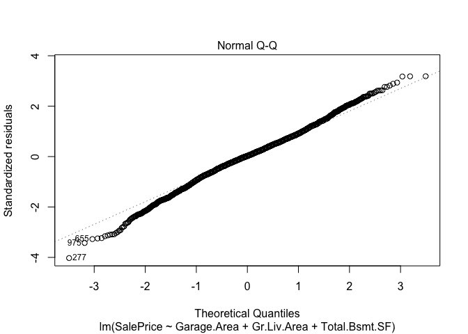<!-- -->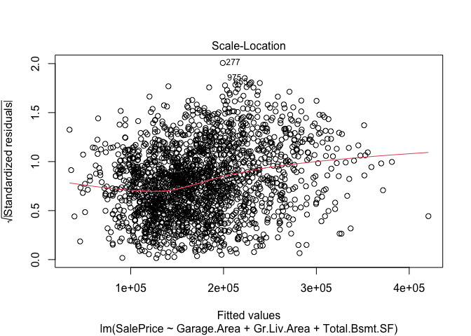<!-- -->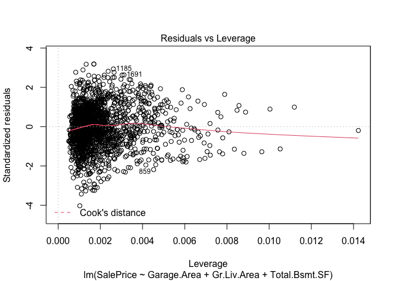<!-- -->

``` r
par(mfrow = c (2,2))
summary(Table_regression2)
```

    ## 
    ## Call:
    ## lm(formula = SalePrice ~ Garage.Area + Gr.Liv.Area + Total.Bsmt.SF)
    ## 
    ## Residuals:
    ##     Min      1Q  Median      3Q     Max 
    ## -116684  -17337     707   17787   92349 
    ## 
    ## Coefficients:
    ##                 Estimate Std. Error t value Pr(>|t|)    
    ## (Intercept)   -38606.069   2511.015  -15.38   <2e-16 ***
    ## Garage.Area      107.961      4.514   23.92   <2e-16 ***
    ## Gr.Liv.Area       73.110      1.744   41.92   <2e-16 ***
    ## Total.Bsmt.SF     54.763      1.934   28.32   <2e-16 ***
    ## ---
    ## Signif. codes:  0 '***' 0.001 '**' 0.01 '*' 0.05 '.' 0.1 ' ' 1
    ## 
    ## Residual standard error: 29000 on 2081 degrees of freedom
    ## Multiple R-squared:  0.7872, Adjusted R-squared:  0.7869 
    ## F-statistic:  2567 on 3 and 2081 DF,  p-value: < 2.2e-16

    Interpretation:

  The findings from the regression model's diagnostics indicate that changes should be made.

Thus, in order to improve the model all the influential observations were removed. Consequently, the model improved noticeably as can be seen on the graph above.
     
    This time around, the Q-Q plotline is almost perfect, and the points appear to be scattered in the Scale-Location graph (as they should be in an effective model). Therefore, removing the outliers in the data was enough to solve the main issues of the model.

### 11 Examining normality assumption

``` r
hist(data.only.numeric$SalePrice)
```

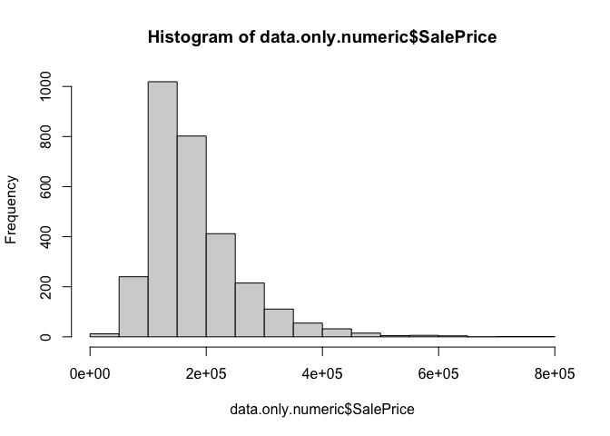<!-- -->

``` r
hist(only.numeric.no.outliers$SalePrice)
```

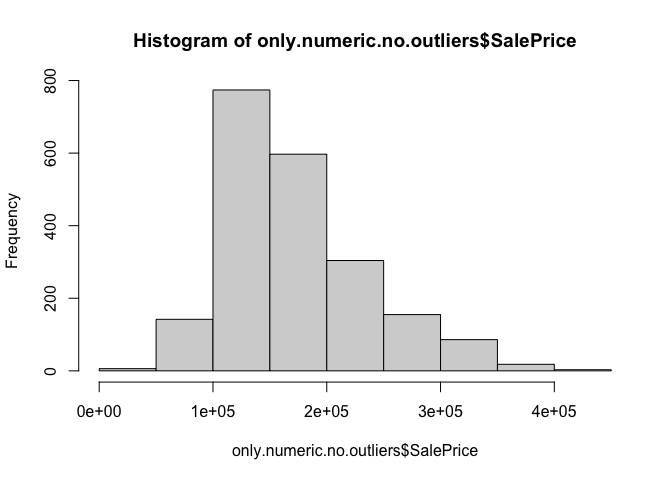<!-- -->

    Interpretation:

    When looking at the histogram of the SalePrice, the data goes from being right-skewed to having a normal distribution.

### 12 Using subsets method to identify the best model

``` r
library(leaps)
regfit_full = regsubsets(SalePrice~., data = only.numeric.noNA)
```

    ## Warning in leaps.setup(x, y, wt = wt, nbest = nbest, nvmax = nvmax, force.in =
    ## force.in, : 2 linear dependencies found

    ## Reordering variables and trying again:

``` r
#a. Looking at the model selected by subsets method
model2 <- lm(SalePrice ~ Overall.Qual + BsmtFin.SF.1 + Gr.Liv.Area)
summary(model2)
```

    ## 
    ## Call:
    ## lm(formula = SalePrice ~ Overall.Qual + BsmtFin.SF.1 + Gr.Liv.Area)
    ## 
    ## Residuals:
    ##     Min      1Q  Median      3Q     Max 
    ## -126507  -16960     397   17331  125132 
    ## 
    ## Coefficients:
    ##                Estimate Std. Error t value Pr(>|t|)    
    ## (Intercept)  -84757.295   2883.213  -29.40   <2e-16 ***
    ## Overall.Qual  24911.885    559.360   44.54   <2e-16 ***
    ## BsmtFin.SF.1     33.792      1.484   22.77   <2e-16 ***
    ## Gr.Liv.Area      64.922      1.717   37.81   <2e-16 ***
    ## ---
    ## Signif. codes:  0 '***' 0.001 '**' 0.01 '*' 0.05 '.' 0.1 ' ' 1
    ## 
    ## Residual standard error: 27070 on 2081 degrees of freedom
    ## Multiple R-squared:  0.8146, Adjusted R-squared:  0.8143 
    ## F-statistic:  3048 on 3 and 2081 DF,  p-value: < 2.2e-16

``` r
plot(model2)
```

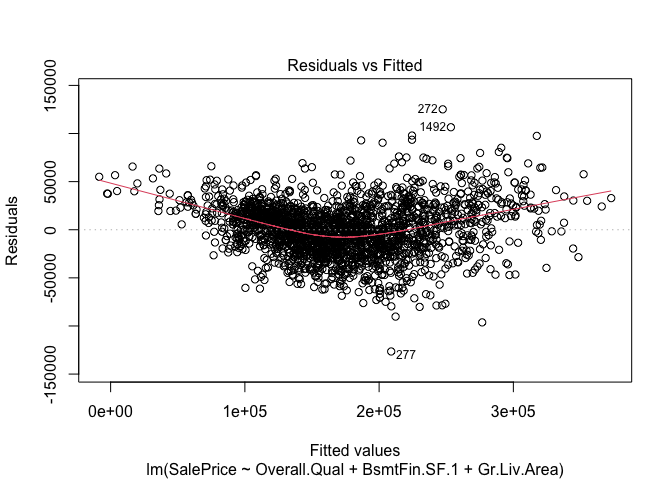<!-- -->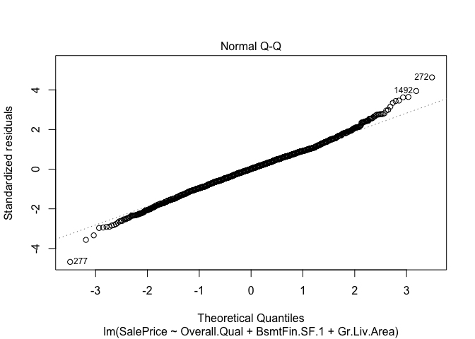<!-- -->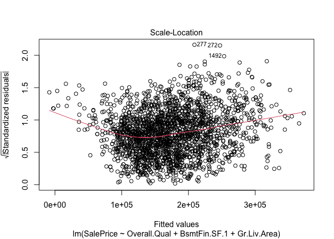<!-- -->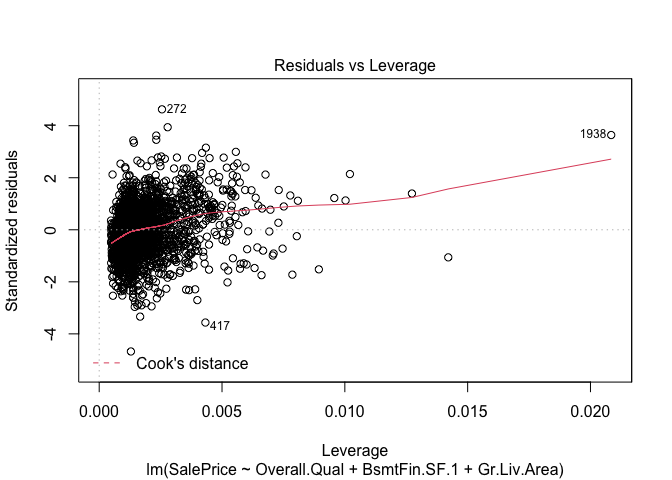<!-- -->

``` r
par(mfrow = c (2,2))
```

    Interpretation

    The best model that was selected by R contained the following variables: Overall.Qual, BsmtFin.SF.1, and Gr.Liv.Area.

Also, the proposal of the computer has a higher adjusted R2 than the manually created model. Nonetheless, before concluding that it is indeed better, the new regression model was plotted to see what its graphs looked like and to determine whether they comply with the necessary assumptions. And, as can be seen, the model contains fewer outliers/influential observations than the one that was first graphed in this paper (before all outliers were eliminated to improve the model). Hence, perhaps it would be more appropriate to use the model created by the subset's method to predict the pricing of houses in Ames Iowa.

### 13 Comparing both models

``` r
library(performance)
compare_performance(Table_regression2, model2, rank = TRUE)
```

    ## # Comparison of Model Performance Indices
    ## 
    ## Name              | Model |    R2 | R2 (adj.) |      RMSE |     Sigma | AIC weights | BIC weights | Performance-Score
    ## ---------------------------------------------------------------------------------------------------------------------
    ## model2            |    lm | 0.815 |     0.814 | 27042.326 | 27068.304 |        1.00 |        1.00 |           100.00%
    ## Table_regression2 |    lm | 0.787 |     0.787 | 28969.787 | 28997.616 |     < 0.001 |     < 0.001 |             0.00%

``` r
#a Visualization of model performance
library(see)
plot(compare_performance(Table_regression2,model2, rank = TRUE))
```

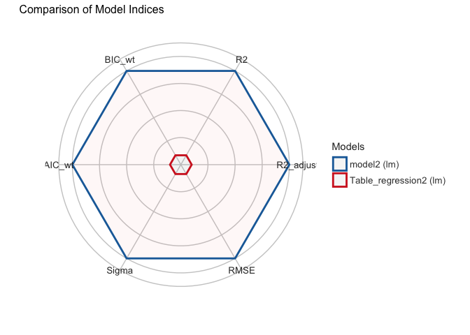<!-- -->

    Interpretation:

    When comparing the model chosen by the subset method vs the one manually elaborated in this paper, the comparisons and evaluations indicate that the best performing model is the one selected by the computer.

    In addition, a plot was drawn to visually check the performance of each model, and once again the one that performs best is the second model (created using the subset's method).

## Conclusion

   Interpretation:
   
The first model was built taking into account only continuous, quantitative variables, namely garage area, above grade living area (sqft), and the total square feet of the basement area. The second one, on the other hand, was created by using the subsets method, and a limit of 3 predictors was set so that it could be compared to the one that was created manually. The resulting model contained the variables overall quality, above grade living area (square feet), and rating of basement finished area (Type 1 finished square feet). 
Both models have one variable in common; above grade living area but differ on the rest.

    When it comes to selecting the most appropriate model, the analysis leans towards the second since it has a higher R-squared value and a better overall score.

   In conclusion, it can be stated that a house with a superior overall quality, a larger above grade living area (square feet), and a better rating of its basement finished area, will have a higher sale price. This information is beneficial for potential buyers or realtors since these 3 variables are what will change the monetary value of houses the most.
